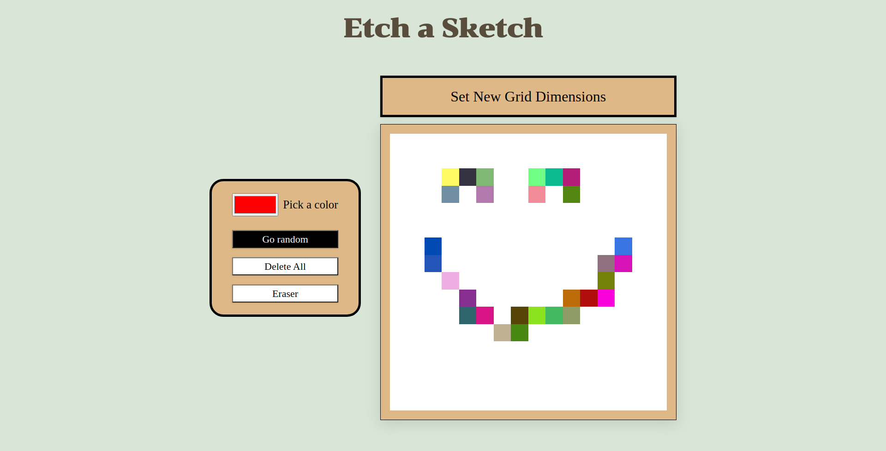

# TOP-ETCH-A-SKETCH

A JS Project as part of the odin project

## Project Description

A webpage featuring a grid fillable canvas

## Technology

- HTML
- CSS
- JS

## Skills Demonstrated

- Layout manipulation using flexbox
- DOM Manipulation
- Variable flagging
  - The mouseDown variable set to false in the global scope serves as a "key" mechanism for the various mouse events
- Event delegation
- Creating multitudes of elements using js and not html
- Naming functions in a descriptive manner
- Breaking a bigger problem into sub problems

## Things to Work On

- Keep the code DRY
